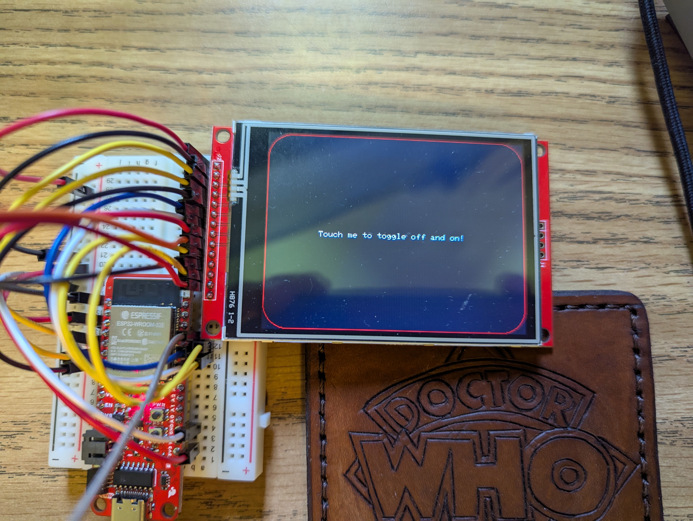

## Enabling touch using the XPT2046 chip of the ILI9341
  
   
  
This example is specifically to:
- Use the XPT2046 chip of the ILI9341
- Display on the ILI9341
  
I prefer the ESP32 devices from Sparkfun because there is community support and the device is easy to configure  
This code is a simple example designed to toggle the display on and off by touching the screen  
The example draws a simple border around the edge of the screen and displays instructional text  
  
The ESP32 was purchased from Sparkfun:  
https://www.sparkfun.com/sparkfun-thing-plus-esp32-wroom-usb-c.html  
  
The ILI9341 is the 3.2" model originally purchased from pjrc.com but now sold by Sparkfun  
These displays are inexpensive and feature rich  
   
I had issues getting the touch screen to work properly until I came across:  
https://registry.platformio.org/libraries/tedtoal/XPT2046_Touchscreen_TT/examples/TouchTest/TouchTest.ino  
